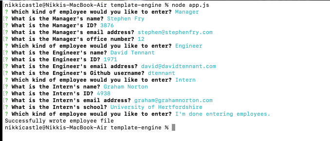
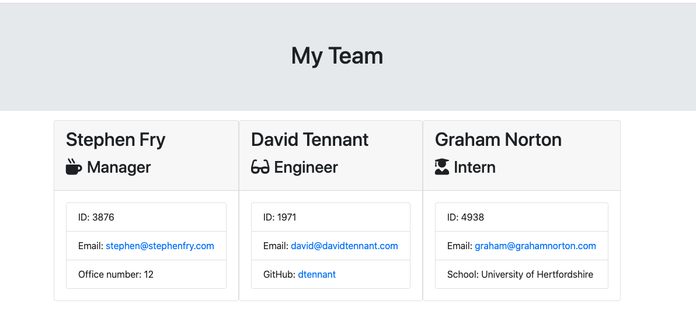

# Employee Team Engine  </img>

## Description
A software engineering team generator command line application used to generate a webpage that will display the team's basic info.

## Table of Contents
1. [Usage](#usage)
2. [Credits](#credits)
3. [License](#license)
4. [Contributing](#contributing)
5. [Tests](#tests)
6. [Questions](#questions)

## Usage
To use this template builder, open the correct directory in your terminal. Run a 'node app.js' command to begin the prompts. Answer all prompts with the corresponding information. Once all questions have been answered, a teamprofile.html will be created in the output directory. 

## Credits
This app was built using starter code provided by the University of Denver Full Stack Flex boot camp. 

## License
GNU General Public License v3

## Contributing
contributer covenant - turn this in to a link to the page

## Tests
Jest testing, list out tests

## Questions?
Please email any questions to [ncastledeveloper@gmail.com](mailto:ncastledeveloper@gmail.com) or find me on Github [nikcastle](https://github.com/nikcastle).
